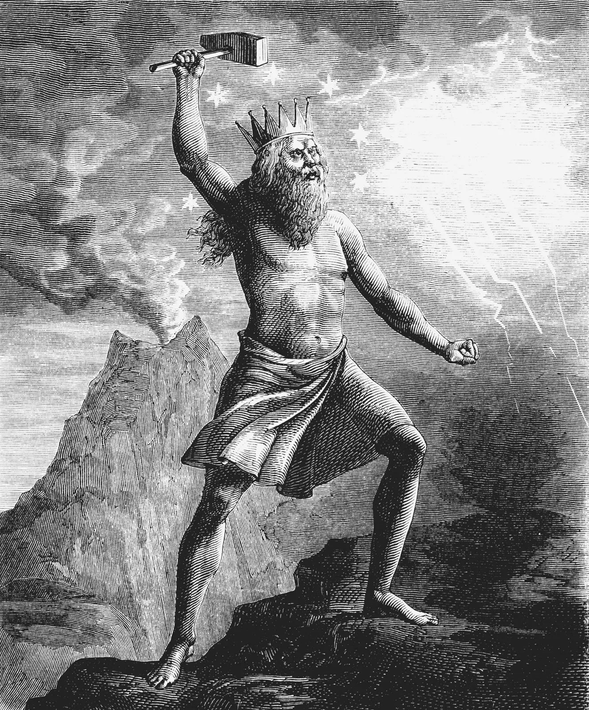
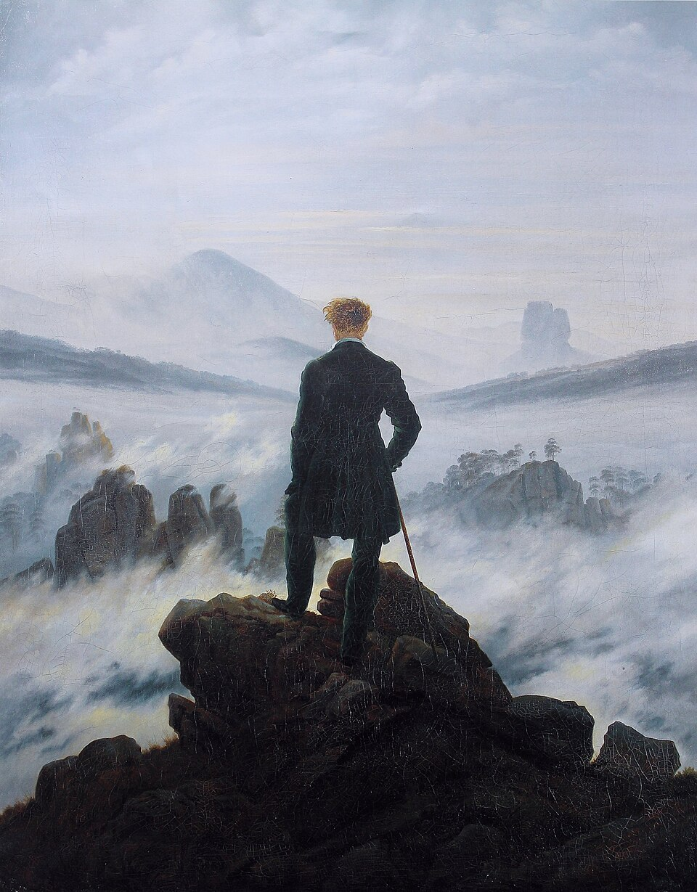

# Boas-vindas {.smaller-columns}

Pergunte à/ao colega ao lado seu **nome**, **curso pretendido** e **pergunta filosófica favorita**:

::: {.columns}

::: {.column width="60%"}

::: {.no-bullets}

- **Filosofia Antiga**

:::
<!-- votos: 1, 2, 2, 0, 1, 2, 1 -->
- Como saber se algo é realmente verdadeiro?
- O que realmente nos deixa feliz?
- O que é justo e injusto?
- As coisas são como parecem ser?
- Do que precisamos para viver bem?
- Tudo muda sempre ou algumas coisas permanecem?
- Como diferenciar o que conseguimos controlar do que devemos simplesmente aceitar?

:::

::: {.column width="40%"}

::: {.no-bullets}

- **Filosofia Medieval**

:::
<!-- votos: 6, 2, 4, 0, 5 -->
- Deus existe?
- Fé e lógica podem andar juntas?
- Por que existe sofrimento no mundo?
- Somos realmente livres para escolher todas as nossas ações?
- Por que vivemos? O que torna a vida significativa?

:::

:::

# Boas perguntas

Uma boa resposta começa com uma boa pergunta.

::: {.smaller-list}

- "Não tem jeito." ➡ "Espera aí... por quê?" / "Será que posso mudar isso?"
- "Sempre foi assim." ➡ "Como começou tudo isso então?"
- "Tudo é relativo." ➡ "Mas será que nada é verdade mesmo?"
- "Eu acho que sim." ➡ "É minha opinião ou é realmente a verdade?"
- "Se todo mundo faz, deve ser ok." ➡ "Coisa que todo mundo faz é necessariamente certa?"
- "Nascemos para coisas diferentes." ➡ "E será mesmo que alguns nasceram para ser servos dos demais?"
- "Tem coisas que são só pra homem/mulher." ➡ "Quem determinou isso mesmo?"

:::

# O que é isto?

## Três perspectivas

::: {.no-bullets}

::: columns

::: {.column width="30%"}

::: {.smaller-list}
- 
- <small>Um castigo dos deuses? Uma mensagem divina? Relâmpago como sinal de poder e controle supremo.</small>
:::

:::

::: {.column width="30%"}

::: {.smaller-list}
- 
- <small>Sem mistério: descargas elétricas entre nuvens e solo. A Física explica.</small>

:::

:::

::: {.column width="30%"}

::: {.smaller-list}
- 
- <small>Por que coisas bonitas e poderosas nos deixam sem palavras?</small>
:::

:::

:::

:::

# Filosofar: método

::: {.columns}

::: {.column width="50%"}

::: {.no-bullets}

- **⁉️ Atitude filosófica**

:::

::: {.smaller-list}

- Ficar espantado com coisas que todo mundo acha normal. ➡ A filosofia nasce do *espanto*.
- Questionar tudo. Sim, tudo mesmo 🙃 ➡ *Crises* podem fazer bem.
- Quando algo não faz sentido, falar algo! ➡ Não se contentar com o *senso comum*.

:::

:::

::: {.column width="50%"}

::: {.no-bullets}

- **🪞 Reflexão filosófica**

:::

::: {.smaller-list}

- Por que você pensa o que pensa?
- De onde vieram suas ideias?
- O que você realmente quer e por quê? ➡ "Conhece-te a ti mesmo." (Sócrates)

:::

:::

:::

# O que (não) é filosofia?

::: {.columns}

::: {.column width="50%"}

::: {.no-bullets}

- **Filosofia não é:**

:::

- Visão de mundo.
- Sabedoria de vida.
- Uma teoria unificada sobre tudo.

:::

::: {.column width="50%"}

::: {.no-bullets}

- **Filosofia é:**

:::

- Um trabalho intelectual sistemático.
- A fundamentação teórica e crítica dos conhecimentos e práticas.

:::

:::

# Filosofia para quê?

- Não cair em papo furado. ➡ Ter senso crítico.
- Questionar quem quer mandar em você sem legitimidade.
- Entender melhor você mesmo e o mundo.
- Lutar por um mundo onde todos possam ser livres e felizes.

# 🫵🏽 Agora é sua vez!

Assista ao videoclipe da canção *Comportamento Geral*, composição de Gonzaguinha interpretada por Elza Soares, e responda:

::: {.smaller-list .nonincremental}
1. Quais atitudes ou comportamentos mostrados no vídeo refletem padrões sociais que aceitamos sem questionar?
2. Como a música nos convida a refletir sobre justiça, liberdade e responsabilidade individual?
:::

  

