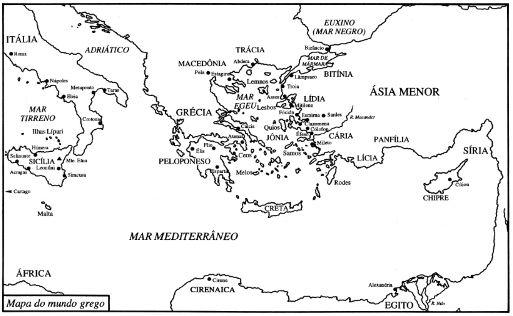

# Contexto histórico-geográfico

<style>
:root {
  --bg-image: url("imagens/aula01/o_nascimento_de_venus.jpg");
}
</style>

::: {.smaller-list}

- Colônias gregas na costa do Mar Egeu, Ásia Menor e sul da Itália
- Século VI a.C.
- Contato com outras culturas (egípcia, babilônica, persa)
- Desenvolvimento da escrita alfabética
- Sociedade urbana e comércio ativo

:::

##

{height=50%}

# Pensamento mítico

::: {.smaller-list}

- ***Mythos*** significa "narrativa", mas também pode significar "mentira".
- Os mitos explicavam a origem do mundo (**cosmogonia**), dos deuses (**teogonia**), dos fenômenos naturais e dos seres humanos.
- Os mitos eram **transmitidos oralmente** e tinham uma função social, religiosa e educativa.
- Os mitos eram **antropomórficos**, ou seja, atribuíam características humanas aos deuses e aos fenômenos naturais.
- Os mitos eram **polissêmicos**, ou seja, podiam ter múltiplas interpretações e significados.
- Os mitos eram **sagrados**, ou seja, tinham um valor religioso e moral para os gregos.
- Os mitos são **produções coletivas**, ou seja, não têm um autor específico e são resultado de um processo de construção social e cultural.
- Os mitos são **dinâmicos**, ou seja, estão sujeitos a mudanças e adaptações ao longo do tempo e do espaço.

:::

## Alguns mitos gregos

::: {.columns}

::: {.column width="50%"}

::: {.smaller-list}

- **Ilíada** e **Odisseia**, de Homero
  - A crise existencial do semi-Deus Aquiles durante a guerra de Troia é um dos temas centrais da Ilíada, onde ele se vê dividido entre a busca pela glória eterna e a vida longa e tranquila. A Odisseia narra a jornada de Odisseu para retornar à sua terra natal após a guerra, enfrentando diversos desafios e perigos, como o encontro com o ciclope Polifemo, a sedução das sereias e a visita ao mundo dos mortos.
  - A Odisseia também aborda temas como a hospitalidade, a fidelidade e a astúcia.
<!-- *"Minha mãe diz que dois destinos me levam à morte. Se eu ficar aqui e lutar em torno da cidade de Troia, minha volta está perdida, mas minha glória será imortal. Mas, se eu voltar para a amada terra pátria, minha glória se perde, mas terei vida longa."* (Canto IX) -->
- **Mito de Prometeu**
  - Prometeu é um titã que rouba o fogo dos deuses e o dá aos humanos, permitindo-lhes desenvolver a civilização. Como punição, Zeus o acorrenta a uma rocha, onde uma águia devora seu fígado diariamente, que se regenera à noite.
- **Mito de Pandora**
  - Pandora é a primeira mulher criada por Zeus, que lhe dá uma caixa (ou jarro) contendo todos os males do mundo. Curiosa, Pandora abre a caixa, liberando o sofrimento, a doença e a morte, mas também a esperança, que permanece dentro da caixa.
- **Mito de Narciso**
  - Narciso é um jovem belo que se apaixona por sua própria imagem refletida na água e acaba morrendo afogado. Em seu lugar nasce uma flor que leva seu nome.

:::

:::

::: {.column width="50%"}

::: {.smaller-list}

- **Mito de Édipo**
  - Édipo é um príncipe que, sem saber, mata seu pai e se casa com sua mãe, cumprindo uma profecia. Quando descobre a verdade, ele se cega e se exila.
- **Mito de Orfeu e Eurídice**
  - Orfeu é um músico talentoso que desce ao mundo dos mortos para resgatar sua esposa Eurídice, que morreu picada por uma serpente. Ele consegue encantá-los com sua música, mas falha ao olhar para trás antes de sair do submundo, perdendo Eurídice para sempre.
- **Mito de Ícaro**
  - Ícaro é um jovem que, junto com seu pai Dédalo, tenta escapar do labirinto onde estão presos usando asas feitas de penas e cera. Dédalo adverte Ícaro para não voar muito alto, mas ele se empolga e acaba derretendo as asas ao se aproximar do sol, caindo no mar e morrendo afogado.
- **Mito de Teseu e o Minotauro**:
  - Teseu é um herói que se voluntaria para entrar no labirinto onde vive o Minotauro, uma criatura metade homem e metade touro, para salvar os jovens atenienses que são sacrificados a ele. Com a ajuda de Ariadne, filha do rei Minos, que lhe dá um novelo de lã para marcar o caminho, Teseu consegue matar o Minotauro e escapar do labirinto.

:::

:::

:::

# Nascimento da ciência {.smaller-list}

- Explicação racional dos fenômenos naturais, sem recorrer a causas sobrenaturais ou mitológicas.
- Busca por **princípios universais** e **leis naturais** que governam o mundo.
- Primeiro filósofo: Tales de Mileto (século VI a.C.).
- O elemento primordial (*arqué*):
  - Tales: água
  - Anaxímenes: ar
  - Anaximandro: o ilimitado (*ápeiron*)
  - Heráclito: fogo
  - Demócrito: átomo
  - Empédocles: os quatro elementos (terra, água, ar e fogo)
- *Cosmo*: ordem, harmonia e beleza do universo (contrapõe-se ao *caos*).
- *Logos*:
  - Discurso racional argumentativo (contrapõe-se ao *mythos*).
  - Explicações justificadas e sujeitas a crítica (contrapõe-se à autoridade e à tradição).
- Atitude crítica:
  - Na Escola de Mileto, os discípulos de Tales não aceitaram suas explicações e buscaram outras alternativas.
  - Segundo Popper, a grande novidade da filosofia grega não foi tanto a **substituição** do mito pelo logos, mas a **crítica** do mito pelo logos.


# Pré-socráticos

::: {.smaller-list}

- Filósofos que viveram antes de Sócrates (século VI a.C. a 399 a.C.).
- Focaram na explicação da natureza, do cosmos e da origem do universo.
- Escola jônica: Tales de Mileto, Anaximandro, Anaxímenes, Xenófanes de Cólofon e Heráclito.
- Escola italiana: Pitágoras de Samos e Parmênides de Eleia.
- Segunda fase (pluralista): Anaxágoras, Escola atomista (Leucipo e Demócrito) e Empédocles.

:::

## Monismo x mobilismo

::: columns

::: {.column width="40%"}

**Parmênides de Eleia**

::: {.smaller-list}

- O ser é uno, imutável e eterno.
- Mesmo na mudança há algo que permanece, portanto a permanência é mais básica que a mudança.
- O mundo sensível é uma ilusão (*realidade* vs. *aparência*).
- “Aquilo que é não pode não ser”.
- *Caminho da Verdade* vs. *Caminho da Opinião*.
- Precursor da **metafísica**.

:::

:::

::: {.column width="40%"}

**Heráclito de Éfeso**

::: {.smaller-list}

- "Tudo flui (*panta rhei*)."
- O ser é múltiplo, mutável e eterno.
- Dicotomias são interdependentes e inseparáveis (ex: dia/noite, vida/morte, guerra/paz).
- O mundo sensível é real, mas está em constante fluxo.
- Precursor da **dialética**.

:::

:::

:::

## Quem disse?

Parmênides ou Heráclito?

::: columns

::: {.column width="40%"}

::: {.smaller-list}
1. “6. Necessário é dizer e pensar que só o ser é; pois o ser é, e o nada, ao contrário, nada é: afirmação que bem deves considerar. (...)”
2. “91. Não se pode entrar duas vezes no mesmo rio. Dispersa-se e se junta novamente, aproxima-se e se distancia.”
3. “51.(...) separando-se podem se harmonizar: harmonia de forças contrárias como o arco e a lira.”
4. “60. O caminho para o alto e para baixo é um e o mesmo.”
5. “7. Jamais se conseguirá provar que o não-ser é. (...)”


:::

:::

::: {.column width="40%"}

::: {.smaller-list}
6. “3. Pois pensar e ser é o mesmo.”
7. “53. A guerra (polemos) é pai de todas as coisas, rei de tudo; de uns fez deuses, de outros homens; de uns, escravos, de outros, homens livres.”
8. “88. Trata-se de uma única e mesma coisa: a vida e a morte, a vigília e o sono, a juventude e a velhice; pois a mudança de um leva ao outro e vice-versa.”
9. “7. Jamais se conseguirá provar que o não-ser é. (...)”

::: {.no-bullets}
- <small>**GABARITO:** 1.P, 2.H, 3.H, 4.H, 5.P, 6.P, 7.H, 8.H, 9.P</small> 
:::

:::

:::

:::

# Questões do Enem

## Questão 1
```{python}
#| echo: false
#| output: asis

from render_questoes import render_questao
from IPython.display import HTML

# Parâmetros da questão
questao_id = 37
arquivo_yaml = "questoes_enem.yaml"

# Renderizar e exibir
html = render_questao(questao_id, arquivo_yaml)
display(HTML(html))
```

## Questão 2
```{python}
#| echo: false
#| output: asis

from render_questoes import render_questao
from IPython.display import HTML

# Parâmetros da questão
questao_id = 33
arquivo_yaml = "questoes_enem.yaml"

# Renderizar e exibir
html = render_questao(questao_id, arquivo_yaml)
display(HTML(html))
```

## Questão 3
```{python}
#| echo: false
#| output: asis

from render_questoes import render_questao
from IPython.display import HTML

# Parâmetros da questão
questao_id = 35
arquivo_yaml = "questoes_enem.yaml"

# Renderizar e exibir
html = render_questao(questao_id, arquivo_yaml)
display(HTML(html))
```


## Questão 4
```{python}
#| echo: false
#| output: asis

from render_questoes import render_questao
from IPython.display import HTML

# Parâmetros da questão
questao_id = 36
arquivo_yaml = "questoes_enem.yaml"

# Renderizar e exibir
html = render_questao(questao_id, arquivo_yaml)
display(HTML(html))
```

## Questão 5
```{python}
#| echo: false
#| output: asis

from render_questoes import render_questao
from IPython.display import HTML

# Parâmetros da questão
questao_id = 17
arquivo_yaml = "questoes_enem.yaml"

# Renderizar e exibir
html = render_questao(questao_id, arquivo_yaml)
display(HTML(html))
```

## Questão 6 {.scrollable}
```{python}
#| echo: false
#| output: asis

from render_questoes import render_questao
from IPython.display import HTML

# Parâmetros da questão
questao_id = 1
arquivo_yaml = "questoes_enem.yaml"

# Renderizar e exibir
html = render_questao(questao_id, arquivo_yaml)
display(HTML(html))
```