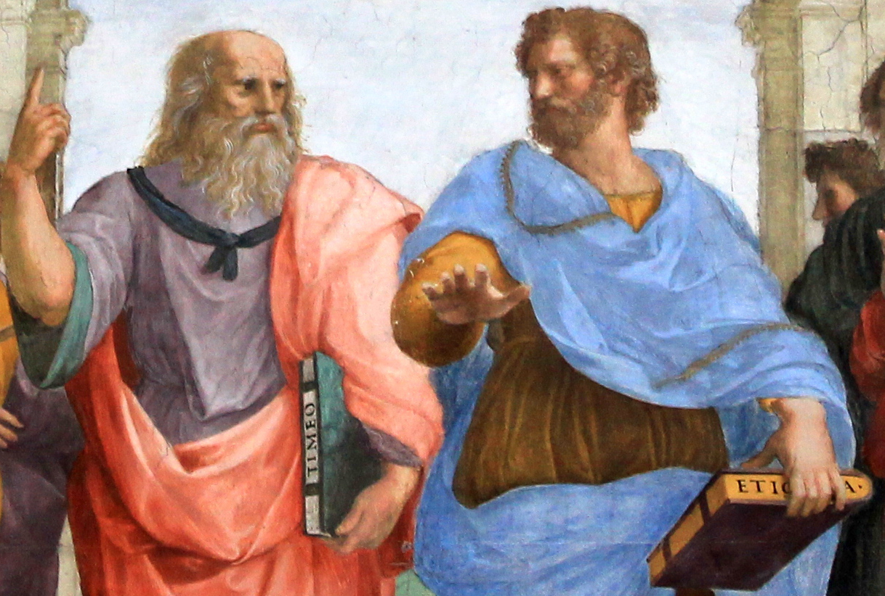
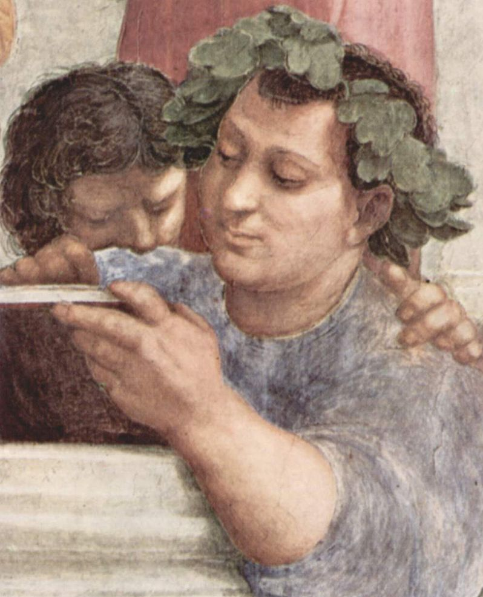
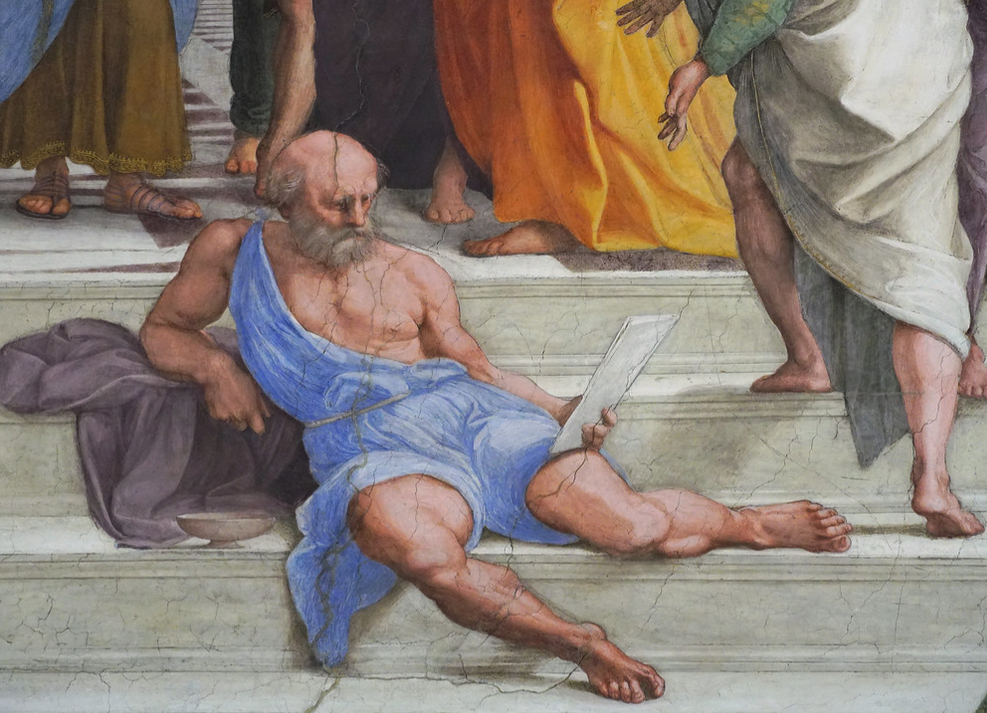

# O que é a boa vida?

::: {style="font-size: 50%;"}


| Conceito  | Aristóteles | Estoicos | Epicuristas | Cínicos | Céticos |
|-----------|------------|------------|-------------|------------|------------|
| **Virtude** | 🟢 Central | 🟢 Central | 🟡 Importante (instrumental) | 🟢 Central | 🔴 Secundária |
| **Tranquilidade** | 🟡 Importante | 🟢 Central | 🟢 Central | 🟡 Importante | 🟢 Central |
| **Liberdade interior** | 🟡 Importante | 🟢 Central | 🟢 Central | 🟢 Central | 🟢 Central |
| **Prazer** | 🔴 Não é o fim | 🔴 Não é o fim | 🟢 Central | 🔴 Geralmente rejeitado como fim | 🔴 Secundário |


:::

# Aristóteles

<script src="https://cdn.jsdelivr.net/npm/mermaid/dist/mermaid.min.js"></script>
<script>
  mermaid.initialize({ startOnLoad: true });
</script>

<style>
:root {
  --bg-image: url("imagens/aula04/rafael_escola_de_atenas.png");
  --bg-opacity: 0.6;
  --max-width: 95%;
}
</style>


## Vida de Aristóteles

::: {.smaller-list}

- Nasce em Estagira, na Macedônia, em 384 a.C.
- Aos 18 anos vai para Atenas estudar filosofia na Academia de Platão.
- Morre em Cálcis, em 322 a.C. (~62 anos)
- Filho de médico, o que pode explicar seu interesse pela pesquisa empírica e biologia.
- Preceptor de Alexandre Magno (356-323 a.C).
- Funda sua própria escola de filosofia, o *Liceu*.
- *Escola peripatética*: suas lições e debates aconteciam durante caminhadas.

:::

## Obra de Aristóteles

::: {.smaller-list}

- O *corpus aristotelicum* que chegou até nós foi constituído por volta de 50 a.C, por Andrônico de Rodes.
- As obras *exotéricas*, isto é, destinadas ao público externo à escola, perderam-se.
- As obras do *corpus aristotelicum* são textos de estudo interno e por isso mais áridos que os diálogos platônicos, por exemplo.

:::

## Continuidade e crítica do platonismo

::: columns
::: {.column width="70%"}
::: {.smaller-list}

- A filosofia de Aristóteles dialoga com a **metafísica** platônica e dá continuidade crítica a ela.
- No entanto, enquanto a metafísica platônica concentra-se nas **ideias** (ou formas), a de Aristóteles foca na **substância** (*ousia*), que une forma inteligível e matéria sensível.
- Assim, Aristóteles critica o **dualismo** da teoria platônica ao remover a separação entre a forma e matéria (**imanência**).
- A teoria de Aristóteles atribui mais importância à experiência sensível, **empírica**, enquanto a de Platão privilegia o conhecimento das formas pelo **intelecto**.
- Tanto Platão quanto Aristóteles procuram conciliar a mudança do mundo sensível (**Heráclito**) com a permanência necessária ao conhecimento (**Parmênides**).

:::

:::

::: {.column width="30%"}

::: {.no-bullets}

- 

:::
:::
:::


## A metafísica aristotélica e as quatro causas

::: {.smaller-list}

- Novo ponto de partida para uma teoria sobre a realidade: a **substância individual**, que corresponde a um indivíduo material concreto (*synolon*).
- A forma compartilhada por indivíduos de uma mesma espécie pode ser conhecida pela observação empírica.
- É importante notar que a forma não é *criada* pelo observador; simplesmente passa a ser *conhecida* por ele.
- Nova epistemologia: *conhecer algo é conhecer suas causas*.
- **Causa formal:** essência.
- **Causa material:** matéria.
- **Causa eficiente:** explicação do aparecimento.
- **Causa final:** explicação do objetivo.

:::

## Potência e ato

Conceitos que explicam como a realidade está em constante transformação.

::: columns

::: {.column width="50%"}

::: {.smaller-list}

::: {.no-bullets}
- **Potência** (*dýnamis*)
:::
- Possibilidade de ser ou tornar-se algo.
- Ainda não realizado.
- O que pode vir a existir.
- **Exemplo:** Uma semente é uma árvore em potência.

:::

:::

::: {.column width="50%"}

::: {.smaller-list}

::: {.no-bullets}
- **Ato** (*enérgeia / entelécheia*)
:::
- Realização plena da potência.
- O ser já concretizado.
- A forma atual da coisa.
- **Exemplo:** A árvore adulta é o ato da semente.

:::

:::

:::

::: {.smaller-list}

- Todo ser em potência **tende ao ato**, que é mais perfeito que a potência.
- O **movimento** é a passagem da potência para o ato.
- As **quatro causas** (material, formal, eficiente e final) explicam o movimento da potência ao ato.

:::

## Felicidade

::: {.smaller-list}

- "Toda arte e todo método, assim como toda ação e escolha, parecem tender para um certo bem; por isso se tem dito, com acerto, que o bem é aquilo para que todas as coisas tendem." - *Ética a Nicômaco* (350 a.C.)
- Ética **teleológica**: tudo que existe tem uma **finalidade**. A do ser humano é a felicidade
- **Eudaimonia:** felicidade, a finalidade da existência humana.
- **Areté:** virtude (bom hábito adquirido), o caminho para o ser humano alcançar a felicidade.
- A virtude está na *justa medida*: covardia x audácia → coragem, arrogância x humilhação → dignidade, etc.
- Três tipos de vida: dos **prazeres**, **política**, **contemplativa**. A justa medida se aplica aqui também. 

:::

## Política

::: {.smaller-list}

- "Sem amigos, ninguém escolheria viver." - *Ética a Nicômaco* (350 a.C.)
- O governo dos cidadãos deve refletir o **bem comum**.
- O cidadão deve participar efetivamente das questões de sua comunidade e precisa ser educado para isso.
- O governo pode ser de um, poucos ou muitos.
- Formas virtuosas de governo: monarquia, aristocracia, politeía.
- Formas corrompidas de governo: tirania, oligarquia, democracia.
- A **democracia** é apresentada como corrompida porque Aristóteles a associa a demagogia, a busca de interesses escusos em nome da maioria.
- A justiça em Aristotéles é **distributiva** (superar as desigualdades de riquezas e honras) e **comutativa** (remediar injustiças que venham a ocorrer).
- Aristóteles justifica a **escravidão**, como um dado da natureza do escravizado, o que se contradiz à suas ideias sobre a amizade.

:::

## Lógica

::: {.smaller-list}

- A lógica não é uma ciência, mas um **instrumento** (*organon*).
- **Silogismo** categórico: Todo homem é mortal. Ora, Sócrates é homem. Logo, Sócrates é mortal.
- A forma do silogismo acima (AAA) garante que o argumento é válido, independentemente do sujeito (Sócrates), predicado (mortal) e do termo médio (homem): Todo M é P. Ora, S é M. Logo, S é P.
- Outro exemplo de silogismo (EAE): Nenhum M é P. Ora, todo S é M. Logo, nenhum S é P.
- Um argumento pode ser **válido** ainda que não seja **verdadeiro**.
- A lógica aristotélica é **dedutiva**.
- Aristóteles formulou os três princípios da lógica matemática, ainda em uso atualmente.
- **Identidade:** A=A e não pode ser de outro modo.
- **Não contradição:** Uma proposição não pode ser verdadeira e falsa ao mesmo tempo e sob as mesmas condições.
- **Terceiro excluído:** Uma proposição ou é verdadeira ou é falsa, não havendo outro julgamento possível.

:::

## Mapa mental

```{mermaid}
mindmap
  root((**Aristóteles**))

    **Vida**
      Estagirita
      Preceptor de Alexandre
      Atenas aos 18 anos
      Liceu
      Escola peripatética

    **Metafísica**
      Critica Platão
      Substância
      Quatro causas
    
    **Lógica**
      Silogismo
      Dedução
    
    **Ética**
      *Eudaimonia*
      *Areté*
    
    **Política**
      Bem comum
      *Politeía*
      Crítica à demagogia
```

# Filosofias Helenísticas

::: {.smaller-list}

- Surgiram após as conquistas de Alexandre Magno, quando a **crise da *pólis*** levou os filósofos a buscar respostas para a **vida individual**.
- Helenismo = fusão greco-oriental.
- Foco na felicidade.
- Busca da tranquilidade interior.
- Preocupação ética e prática.
- Menos interesse pela política da cidade.
- **Cosmopolitismo**: ideia de "cidadão do mundo", universalismo moral.

:::

## Estoicismo

::: {.smaller-list}

- **Fundador:** Zenão de Cítio (333-263 a.C)
- **Virtude** como o bem supremo.
- **Autocontrole** das paixões e emoções.
- Viver de acordo com a **razão** e a natureza.
- **Aceitação** serena dos acontecimentos.
- O Enem costuma associar o estoicismo à disciplina pessoal, racionalidade e resistência diante das adversidades.

:::

## Epicurismo

::: columns
::: {.column width="70%"}

::: {.smaller-list}

- **Fundador:** Epicuro de Samos (341-271 a.C.)
- Busca da felicidade por meio do **prazer** moderado.
- Evitar **dores** físicas e **perturbações** da alma.
- Valorizar amizades, simplicidade e equilíbrio.
- **Ataraxia**: estado de tranquilidade interior.
- ⚠️ Epicurismo não significa busca excessiva de prazeres: Epicuro defendia prazeres simples e a moderação.

:::

:::

::: {.column width="30%"}

::: {.no-bullets}

- 

:::
:::
:::

## Cinismo

::: columns
::: {.column width="70%"}

::: {.smaller-list}

- **Principal representante:** Diógenes de Sinope (404-323 a.C.)
- Vida simples e **autossuficiente**.
- Crítica às riquezas e ao **luxo**.
- Rejeição das **convenções sociais**.
- Liberdade em relação às **necessidades** artificiais.
- A felicidade não depende de bens materiais.

:::

:::

::: {.column width="30%"}

::: {.no-bullets}

- 

:::
:::
:::

## Ceticismo

::: {.smaller-list}

- **Fundador:** Pirro de Élis (360-270 a.C.)
- Dificuldade de alcançar **verdades absolutas**.
- **Suspensão do juízo** (*epoché*).
- Evitar afirmações categóricas.
- **Tranquilidade** obtida pela dúvida crítica.
- O Enem costuma relacionar o ceticismo à postura crítica diante do conhecimento.

:::

# Mapa mental

```{mermaid}
mindmap
  root((**Helenismo**<br>Séc. IV-I a.C.))

    **Estoicos**
      Virtude
      Autocontrole
      Razão
      Resignação

    **Epicuristas**
      Tranquilidade
      Evitação da\ndor
      Prazer\nmoderado
    
    **Cínicos**
      Simplicidade
      Desprezo por\nconvenções
      Autossuficiência
    
    **Céticos**
      Suspensão do\njuízo
      Crítica do\nconhecimento
```


```{python}
#| echo: false
#| output: asis

from scripts.render_questoes import render_questao
from IPython.display import HTML

arquivo_yaml = "questoes_enem.yaml"

questoes = [2, 14, 15, 29, 46, 47, 48, 49, 50, 51, 52, 53, 54, 59, 67, 71, 89]

print("# Questões do Enem")

for i, questao_id in enumerate(questoes, start=1):

  print(f"## Questão {i}")
  html = render_questao(questao_id, arquivo_yaml)
  display(HTML(html))
```
