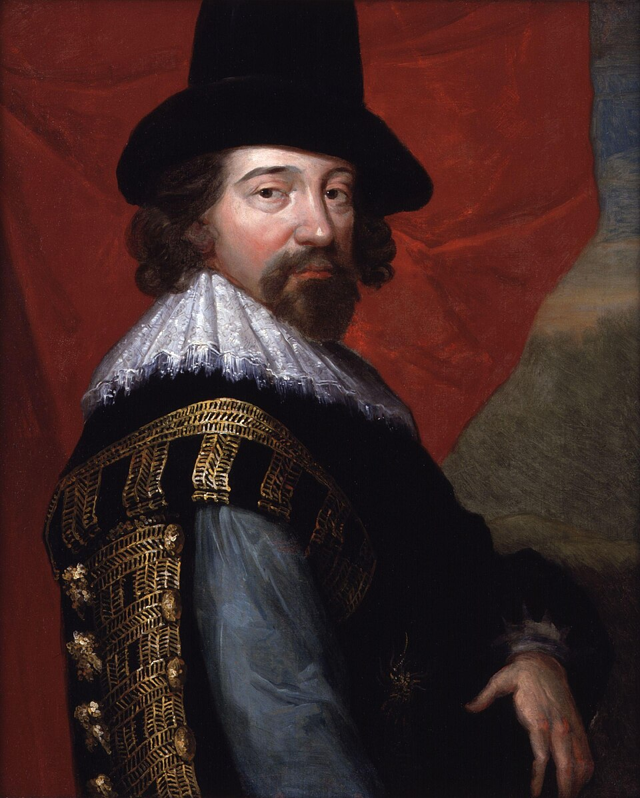
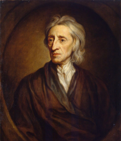
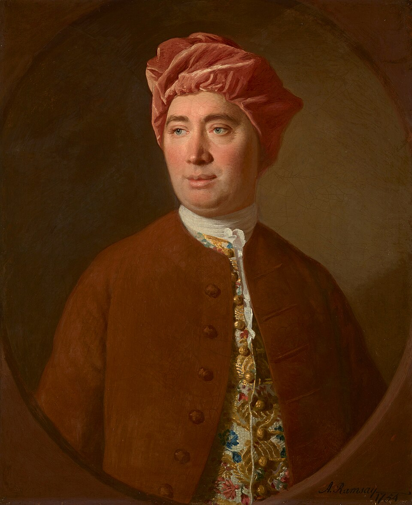
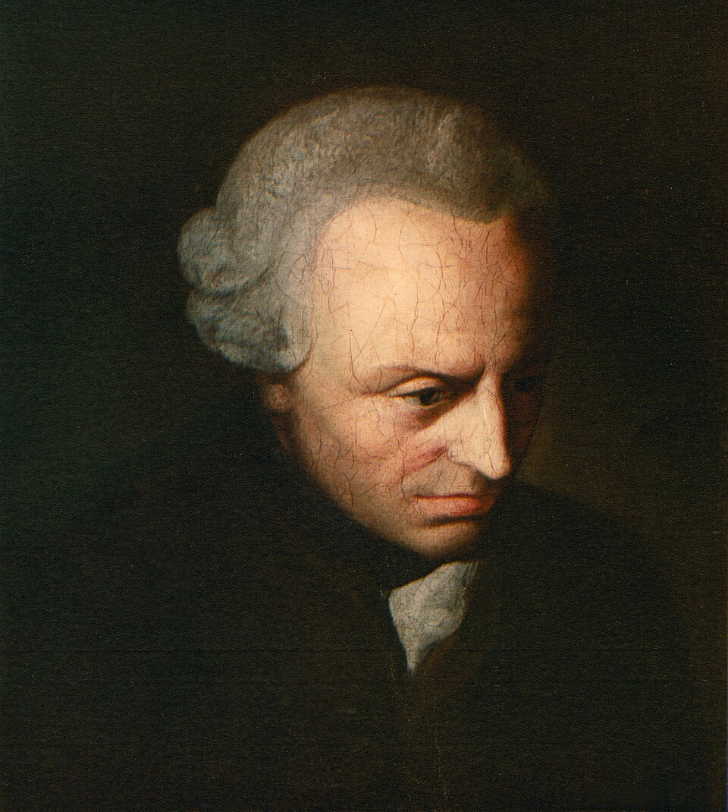

# Racionalismo *vs* Empirismo

<style>
:root {
  --bg-image: url("imagens/aula07/verdades_apoditicas_by_jacob_smies_1774_1833.jpg");
  --bg-opacity: 0.5;
  --max-width: 95%;
}
</style>

## Empirismo: conceitos iniciais

::: {.smaller-list}

- ***Empeiria* = Experiência**: o termo Empirismo vem da palavra grega para *experimentação*.
- Filósofos **racionalistas**, como Descartes, Spinoza e Leibniz, valorizavam a certeza que o conhecimento especulativo traz.
- Os filósofos da Modernidade que hoje chamamos de **empiristas** consideravam vazias as formas de conhecimento predominantemente racional e davam mais relevância ao conhecimento oriundo da experiência humana.
- Compare: **"Um triângulo tem três lados"** com **"A água ferve a 100ºC ao nível do mar"**. A primeira sentença é um desdobramento lógico da definição de *triângulo*, enquanto a segunda agrega um conhecimento empírico a respeito da *água*.
- Já uma sentença como **"A soma dos ângulos internos de qualquer triângulo resulta em 180°"**, apesar de não depender de observações empíricas, parece agregar um novo conhecimento (embora Hume acredite que se trata de uma sentença vazia de conteúdo, apenas com mais passos para ser formulada).
- ⚠️ Veremos adiante que é justamente esse terceiro tipo de sentença que leva Kant a propor uma nova categoria: o **juízo sintético *a priori***.

:::

## Francis Bacon (1561-1626)

::: columns
::: {.column width="70%"}

::: {.smaller-list}

- Considerado um dos criadores do pensamento moderno, juntamente com Descartes.
- Sua concepção do método científico estava centrada na **experimentação**.
- Em *Novum organum* (1620), critica a concepção dedutiva da ciência, oriunda do *Órganon* aristotélico.
- Suas duas principais contribuições à epistemologia são o **pensamento crítico**, manifesto em sua **teoria dos ídolos**, e a valorização do **método indutivo** para a construção de uma ciência integrada à técnica, e não meramente especulativa.
- **Dedução**: Todo homem é mortal. Ora, Sócrates é um homem. Logo, Sócrates é mortal.
- **Indução**: O cisne $C_1$ é branco. O cisne $C_2$ é branco. (...) O cisne $C_n$ é branco. Logo, todo cisne é branco.
- Na visão dos empiristas, o simples fato de a indução não conduzir a uma **certeza** lógica não invalida o conhecimento que ela produz.

:::

:::

::: {.column width="30%"}

::: {.no-bullets}

- 

:::

:::

:::

## John Locke (1632-1704)

::: columns
::: {.column width="70%"}

::: {.smaller-list}

- Principal fundador do **empirismo britânico**, ao lado de Hume.
- Em *Ensaio acerca do entendimento humano* (1689), ataca a teoria das **ideias inatas** defendida pelos racionalistas.
- Para Locke, a mente humana nasce como uma **tábula rasa** (*tabula rasa*): uma folha em branco, sem nenhum conteúdo prévio.
- Todo conhecimento vem da **experiência**, seja pela **sensação** (dados dos sentidos sobre o mundo externo) ou pela **reflexão** (a mente observando suas próprias operações).
- Para Locke, portanto, **mesmo as ideias são originadas na experiência**, pois são representações mentais de objetos conhecidos pela experiência.
- O conhecimento verdadeiro (***true knowledge***) sobre o mundo natural é impossível. Temos apenas crenças e opiniões a respeito dele.
- Somente o **conhecimento dedutivo**, como o da geometria, pode ser certo e definitivo, por não ser empírico.

<!-- - Distingue **qualidades primárias** dos objetos (forma, extensão, movimento, que existem no próprio objeto) e **qualidades secundárias** (cor, sabor, som, que dependem da percepção do sujeito).
- Também é conhecido por sua filosofia política, com a defesa dos **direitos naturais** (vida, liberdade e propriedade) e do **contratualismo liberal**. -->

:::

:::

::: {.column width="30%"}

::: {.no-bullets}

- 

:::

:::

:::

## David Hume (1711-1776)

::: columns
::: {.column width="70%"}

::: {.smaller-list}

- O mais **radical dos empiristas**: leva os princípios de Locke às últimas consequências.
- Em *Tratado da natureza humana* (1739) e *Investigação sobre o entendimento humano* (1748), divide as percepções da mente em **impressões** (experiências vivas e imediatas) e **ideias** (cópias mais fracas das impressões, usadas para pensar).
- Sua crítica mais célebre é à noção de **causalidade**: nunca observamos uma "força" que ligue causa e efeito, apenas a **repetição constante** de eventos em sucessão. A crença em causa e efeito é um **hábito** da mente, não uma certeza racional.
- Isso mina a possibilidade de conhecimento necessário e universal sobre o mundo, levando Hume a um **ceticismo** quanto ao alcance da razão.
- Immanuel Kant afirmou que a leitura de Hume o **despertou de seu sono dogmático**, impulsionando sua própria filosofia crítica.

:::

:::

::: {.column width="30%"}

::: {.no-bullets}

- 

:::

:::

:::

# A filosofia crítica de Kant

## Immanuel Kant (1724-1804)

::: columns
::: {.column width="70%"}

::: {.smaller-list}

- Kant realiza uma ***revolução copernicana*** na epistemologia: em vez de focar nos objetos que podem ser conhecidos, investiga o próprio processo mental do sujeito enquanto elabora conhecimentos sobre objetos concretos ou abstratos.
- Busca conciliar racionalismo e empirismo: contra os racionalistas, afirma que **todo conhecimento começa com a experiência**; contra os empiristas, sustenta que **nem todo conhecimento deriva apenas da experiência**.
- A mente humana não é uma tábula rasa passiva. Ela possui estruturas *a priori* (anteriores à experiência) que organizam os dados sensíveis: as formas puras da sensibilidade (**espaço** e **tempo**) e as **categorias do entendimento** (como causalidade e substância, entre outras).

:::

:::

::: {.column width="30%"}

::: {.no-bullets}

- 

:::

:::

:::

## Immanuel Kant (1724-1804)

::: {.smaller-list}

::: {.no-bullets}
- **Fenômeno *vs.* *noumeno***
:::

- Como o conhecimento é sempre filtrado por essas estruturas da mente, Kant distingue o ***fenômeno*** (a coisa tal 
como aparece a nós, já organizada pelo espaço, tempo e categorias) do ***noumeno*** ou **coisa em si** (*Ding an sich*).
- **Só temos acesso ao fenômeno; o *noumeno* permanece incognoscível**, um limite intransponível para a razão.

::: {.no-bullets}
- **Juízos sintéticos *a priori***
:::

- Distingue **juízos analíticos** (o predicado já está contido no sujeito, ex.: *"um triângulo tem três lados"*) de **juízos sintéticos** (o predicado acrescenta algo novo, ex.: *"a água ferve a 100ºC"*).
- Contra Hume, mostra que a terceira sentença do início da aula (*"a soma dos ângulos internos de um triângulo é 180°"*) não é analítica: o conceito de *triângulo* não contém logicamente essa soma, é preciso **construir a figura no espaço** para obtê-la. É, portanto, **sintética**; e, como vale universal e necessariamente, sem depender de observação, é também ***a priori***.
- Sua grande pergunta é: como são possíveis **juízos sintéticos *a priori***, universais e necessários como os racionalistas queriam, mas que ampliam nosso conhecimento como os empiristas exigiam?
- Essa investigação é desenvolvida na *Crítica da razão pura* (1781), obra fundadora do **idealismo transcendental**.

:::

# Questões do Enem

## Acompanhe pelo celular

::: {style="text-align: center;"}

{width=40%}

bit.ly/filosofia-vc

:::

```{python}
#| echo: false
#| output: asis

from scripts.render_questoes import render_questao
from IPython.display import HTML

arquivo_yaml = "questoes_enem.yaml"

questoes = [8, 10, 72, 97, 98]

for i, questao_id in enumerate(questoes, start=1):

  print(f"## Questão {i}")
  html = render_questao(questao_id, arquivo_yaml)
  display(HTML(html))
```
