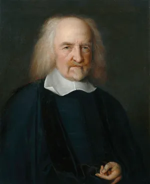
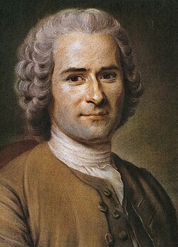

# Maquiavel: Realismo político

<style>
:root {
  --bg-image: url("imagens/aula08/liberdade_guiando_o_povo_by_eugene_delacroix_1830.jpg");
  --bg-opacity: 0.7;
  --max-width: 95%;
}
</style>

::: {.smaller-list}

- Um governante deve fazer o que é moralmente correto ou aquilo que é necessário para manter o Estado?
- Segundo Maquiavel, a política possui uma lógica própria, diferente da moral individual.

::: {.no-bullets}
<!-- ::: {style="font-size: 0.6em;"} -->

- > Todavia, como é meu intento escrever coisa útil para os que se interessarem, pareceu-me mais conveniente procurar a verdade pelo efeito das coisas, do que pelo que delas se possa imaginar. E muita gente imaginou repúblicas e principados que nunca se viram nem jamais foram reconhecidos como verdadeiros. Vai tanta diferença como se vive e como se deveria viver. (Maquiavel, O Príncipe, Cap. XV)

:::

:::


## Nicolau Maquiavel (1469-1527)

::: columns
::: {.column width="70%"}

::: {.smaller-list}

- Nasceu e viveu em Florença, na Itália renascentista. A Itália ainda não era um Estado nacional unificado.
- Maquiavel participou diretamente da vida política de Florença.
- Escreveu *O Príncipe* em um contexto de intensa instabilidade.
- **Realismo político**: É considerado um dos fundadores da filosofia política moderna por deslocar o foco do governo ideal (Platão, Aristóteles) para a análise da realidade efetiva do poder político.
- Sua análise política baseia-se, portanto, em elementos concretos do dia-a-dia do governante, tais como: disputa pelo poder, conflitos entre grupos, interesses, ambição, alianças, circunstâncias históricas, manutenção do Estado etc.
- **Autonomia da política**: a eficácia política é imperativa sobre a virtude moral.
- ⚠️ Isso não significa que “qualquer coisa é permitida”, mas que a **conservação do Estado** tem primazia sobre a moral convencional.

:::

:::

::: {.column width="30%"}


:::

:::

## Nicolau Maquiavel (1469-1527)

::: {.smaller-list}

::: {.no-bullets}
- ***Virtù*** *vs.* ***Fortuna***
:::

- ***Virtù***: não é virtude moral, mas a capacidade e astúcia do governante para agir com eficácia diante das circunstâncias.
- ***Fortuna***: o acaso, as circunstâncias imprevisíveis. Maquiavel a compara a um rio: a *virtù* pode contê-lo em parte, mas nunca dominá-lo.

::: {.no-bullets}
- Ser amado *vs.* ser temido
:::

- Entre ser **amado** e ser **temido**, é mais seguro ser temido: o amor é um vínculo frágil; o temor, sustentado pelo medo do castigo, não falha.
- Ainda assim, o governante deve evitar a todo custo ser **odiado**, que representa o maior risco à permanência no poder.

:::

# Contrato Social

## Contrato Social

::: {.smaller-list}

- Diferentemente de Maquiavel, que descreve como o poder **de fato** funciona, os **contratualistas** buscam **justificar** a autoridade política: por que devemos obedecer ao Estado?
- Hobbes, Locke e Rousseau partem de um mesmo recurso teórico: imaginar um **estado de natureza**, hipotético, anterior à sociedade civil, para então explicar por que os indivíduos concordariam em formar um **contrato (ou pacto) social**.
- O governo legítimo é aquele que resulta desse acordo entre os indivíduos, e não da força, da tradição ou de um suposto direito divino dos reis.
- Cada um dos três filósofos imagina um estado de natureza e um contrato bem diferentes, e por isso chegam a conclusões políticas opostas — do absolutismo à democracia direta.

:::

## Thomas Hobbes (1588-1679)

::: columns
::: {.column width="70%"}

::: {.smaller-list}

- Viveu a **Guerra Civil Inglesa**, experiência que marcou profundamente sua visão pessimista da natureza humana e da política.
- **Estado de natureza**: sem um poder comum que os contenha, os homens vivem em **guerra de todos contra todos** (*bellum omnium contra omnes*) — "o homem é o lobo do homem" (*homo homini lupus*).
- Nesse estado, ninguém está seguro: a vida é, em suas palavras, "solitária, pobre, sórdida, embrutecida e curta".
- **Contrato social**: para escapar desse caos, os indivíduos transferem **todos** os seus direitos naturais a um soberano absoluto — o **Leviatã** —, em troca de paz e segurança.
- Uma vez firmado, o pacto é **irrevogável**: para Hobbes, é sempre preferível um poder absoluto à guerra civil.
- Obra principal: *Leviatã* (1651).

:::

:::

::: {.column width="30%"}



:::

:::

## John Locke (1632-1704)

::: columns
::: {.column width="70%"}

::: {.smaller-list}

- Ao contrário de Hobbes, Locke imagina um **estado de natureza** relativamente pacífico, já regido pela razão e por uma **lei natural** que garante a todos os direitos à **vida, liberdade e propriedade**.
- O problema desse estado não é a guerra constante, mas a **insegurança**: não há um juiz imparcial para resolver conflitos nem garantir o cumprimento desses direitos.
- **Contrato social**: os indivíduos se unem para formar um governo civil que **proteja melhor** os direitos que já possuíam por natureza — e não para escapar do caos, como em Hobbes.
- O poder do governo é **limitado** e baseado no **consentimento** dos governados; se ele viola os direitos naturais (tirania), o povo tem o **direito de resistência**.
- É considerado um dos fundadores do **liberalismo político** e do **constitucionalismo** modernos.
- Obra principal: *Segundo tratado sobre o governo civil* (1689).

:::

:::

::: {.column width="30%"}


:::

:::

## Jean-Jacques Rousseau (1712-1778)

::: columns
::: {.column width="70%"}

::: {.smaller-list}

- Para Rousseau, no estado de natureza o ser humano é **livre, igual e bom** — o chamado **"bom selvagem"**. A desigualdade e a corrupção moral surgem depois, com a sociedade civil e a **propriedade privada**.
- Sua obra *Do contrato social* (1762) começa com a célebre frase: "O homem nasce livre, e por toda a parte encontra-se a ferros".
- **Contrato social**: diferente de Hobbes (transferência de poder a um soberano) e de Locke (governo limitado que protege direitos), Rousseau propõe que os indivíduos formem um **corpo político coletivo**, submetido à **vontade geral**.
- A soberania pertence ao **povo**, que legisla para si mesmo; **liberdade**, aqui, é obedecer a leis que nós mesmos, coletivamente, nos demos.
- Suas ideias influenciaram diretamente a **Revolução Francesa** e a teoria democrática moderna.

:::

:::

::: {.column width="30%"}



:::

:::

# Iluminismo

## Iluminismo

::: {.smaller-list}

- Movimento intelectual europeu do **século XVIII** (com epicentro na França), que valoriza a **razão**, a crítica e a ciência como caminhos para o progresso humano, contra a tradição, a superstição e a autoridade incontestada da Igreja e da monarquia absoluta.
- O lema do movimento é resumido por Kant, no texto *O que é esclarecimento?* (1784): ***"Sapere aude!"*** ("Ousa saber!") — ter a coragem de usar o próprio entendimento, sem a tutela de outrem.
- Para Kant, o esclarecimento (*Aufklärung*) é a saída do ser humano de sua **menoridade intelectual**, da qual ele mesmo é o culpado, por comodismo ou covardia em pensar por si só.
- Assume e radicaliza as ideias contratualistas de Locke e Rousseau, usando-as para **criticar o absolutismo** e defender governos baseados no **consentimento** e na razão, e não na tradição ou na força.
- Outros valores centrais: **tolerância religiosa**, **liberdade individual**, **direitos naturais** e **laicidade** (separação entre Igreja e Estado).

:::

## Iluminismo: figuras e legado

::: {.smaller-list}

- **Montesquieu** (1689-1755): em *O espírito das leis* (1748), defende a **separação dos poderes** (Executivo, Legislativo e Judiciário) como forma de evitar a concentração e o abuso do poder — ideia presente até hoje nas constituições democráticas.
- **Voltaire** (1694-1778): crítico do fanatismo religioso e da intolerância, defensor da **liberdade de expressão** e de um Estado mais racional e tolerante.
- **Diderot** e **D'Alembert**: organizam a *Enciclopédia* (1751-1772), obra que reúne e divulga o conhecimento humano da época, disseminando as ideias iluministas por toda a Europa.
- O Iluminismo fornece a base intelectual para a **Revolução Americana** (1776) e a **Revolução Francesa** (1789), que consagra a *Declaração dos Direitos do Homem e do Cidadão*.

:::

# Questões do Enem

## Acompanhe pelo celular

::: {style="text-align: center;"}

{width=40%}

bit.ly/filosofia-vc

:::

```{python}
#| echo: false
#| output: asis

from scripts.render_questoes import render_questao
from IPython.display import HTML

arquivo_yaml = "questoes_enem.yaml"

questoes = [21, 77, 83, 26]

for i, questao_id in enumerate(questoes, start=1):

  print(f"## Questão {i}")
  html = render_questao(questao_id, arquivo_yaml)
  display(HTML(html))
```
