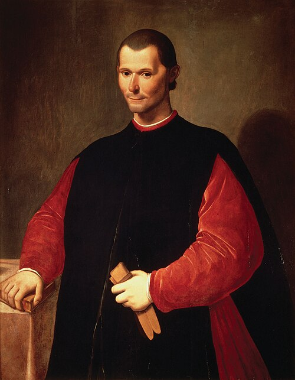

# Maquiavel: Realismo político

<style>
:root {
  --bg-image: url("imagens/aula08/liberdade_guiando_o_povo_by_eugene_delacroix_1830.jpg");
  --bg-opacity: 0.7;
  --max-width: 95%;
}
</style>

::: {.smaller-list}

- Um governante deve fazer o que é moralmente correto ou aquilo que é necessário para manter o Estado?
- Segundo Maquiavel, a política possui uma lógica própria, diferente da moral individual.

::: {.no-bullets}
<!-- ::: {style="font-size: 0.6em;"} -->

- > Todavia, como é meu intento escrever coisa útil para os que se interessarem, pareceu-me mais conveniente procurar a verdade pelo efeito das coisas, do que pelo que delas se possa imaginar. E muita gente imaginou repúblicas e principados que nunca se viram nem jamais foram reconhecidos como verdadeiros. Vai tanta diferença como se vive e como se deveria viver. (Maquiavel, O Príncipe, Cap. XV)

:::

:::


## Nicolau Maquiavel (1469-1527)

::: columns
::: {.column width="70%"}

::: {.smaller-list}

- Nasceu e viveu em Florença, na Itália renascentista. A Itália ainda não era um Estado nacional unificado.
- Maquiavel participou diretamente da vida política de Florença.
- Escreveu *O Príncipe* em um contexto de intensa instabilidade.
- **Realismo político**: É considerado um dos fundadores da filosofia política moderna por deslocar o foco do governo ideal (Platão, Aristóteles) para a análise da realidade efetiva do poder político.
- Sua análise política baseia-se, portanto, em elementos concretos do dia-a-dia do governante, tais como: disputa pelo poder, conflitos entre grupos, interesses, ambição, alianças, circunstâncias históricas, manutenção do Estado etc.
- **Autonomia da política**: a eficácia política é imperativa sobre a virtude moral.
- ⚠️ Isso não significa que “qualquer coisa é permitida”, mas que a **conservação do Estado** tem primazia sobre a moral convencional.

:::

:::

::: {.column width="30%"}



:::

:::

## Nicolau Maquiavel (1469-1527)

::: {.smaller-list}

::: {.no-bullets}
- ***Virtù*** *vs.* ***Fortuna***
:::

- ***Virtù***: não é virtude moral, mas a capacidade e astúcia do governante para agir com eficácia diante das circunstâncias.
- ***Fortuna***: o acaso, as circunstâncias imprevisíveis. Maquiavel a compara a um rio: a *virtù* pode contê-lo em parte, mas nunca dominá-lo.

::: {.no-bullets}
- Ser amado *vs.* ser temido
:::

- Entre ser **amado** e ser **temido**, é mais seguro ser temido: o amor é um vínculo frágil; o temor, sustentado pelo medo do castigo, não falha.
- Ainda assim, o governante deve evitar a todo custo ser **odiado**, que representa o maior risco à permanência no poder.

:::


# Questões do Enem

## Acompanhe pelo celular

::: {style="text-align: center;"}

{width=40%}

bit.ly/filosofia-vc

:::

```{python}
#| echo: false
#| output: asis

from scripts.render_questoes import render_questao
from IPython.display import HTML

arquivo_yaml = "questoes_enem.yaml"

questoes = [21, 77, 83, 26]

for i, questao_id in enumerate(questoes, start=1):

  print(f"## Questão {i}")
  html = render_questao(questao_id, arquivo_yaml)
  display(HTML(html))
```
