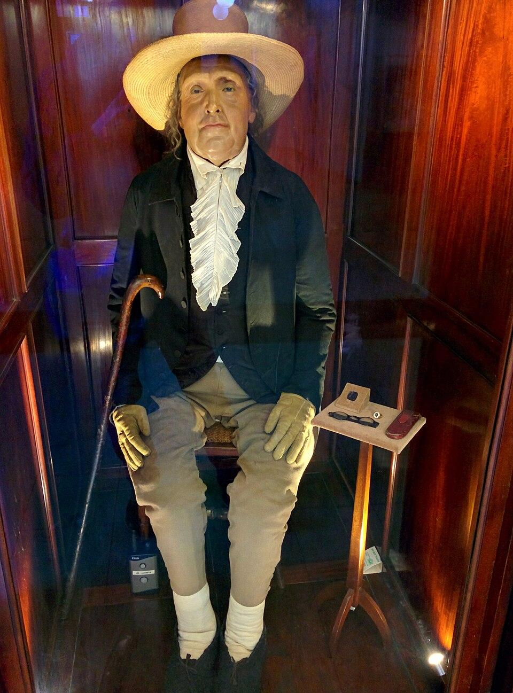
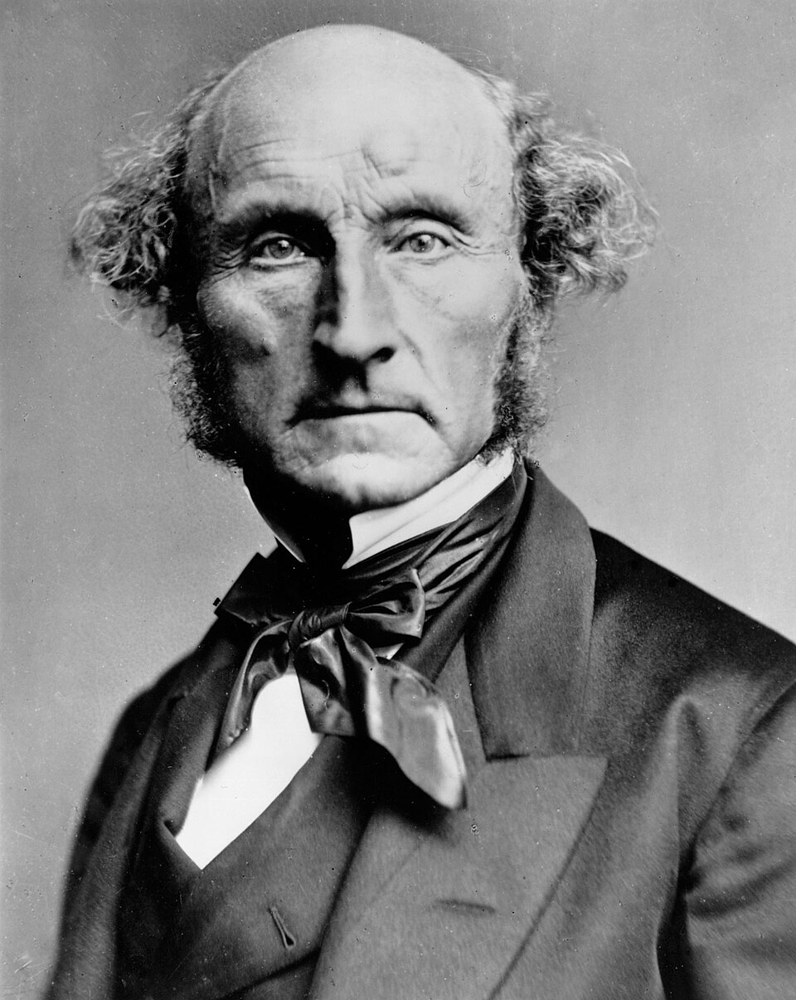
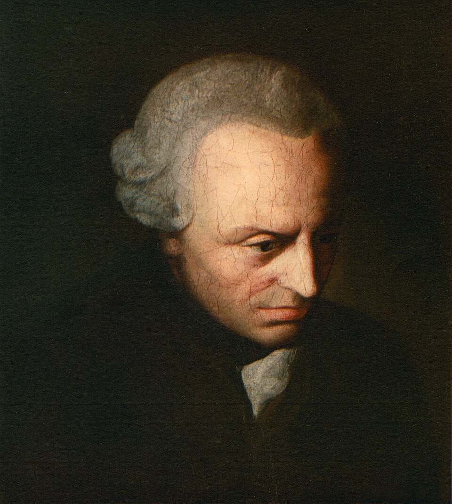

# Dilemas éticos

<style>
:root {
  --bg-image: url("imagens/aula09/trolley_problem_by_kyle_t_webster_2015.jpg");
  --bg-opacity: 0.8;
  --max-width: 95%;
}
</style>

::: {.smaller-list}

- Imagine que você pode desviar um trem desgovernado para outro trilho, salvando cinco pessoas, mas matando uma pessoa que está nesse outro trilho. A maioria das pessoas diz que é certo desviar o trem.
- Agora imagine que a única forma de salvar as cinco pessoas é empurrar alguém de uma ponte, na frente do trem. O resultado numérico é o mesmo, mas a maioria diz que empurrar é errado.
- Esses dilemas (o chamado **"dilema do trem"**) revelam uma divisão real em nós: por vezes julgamos pelas **consequências** de uma ação (ética **consequencialista**) e por vezes pelo **tipo de ação em si**, independentemente do resultado (ética **deontológica**).
- Outro problema: mesmo que aceitássemos buscar "o bem de todos", quem decide o que é esse bem, e o impõe a todos? Um governante que decidisse, de forma despótica, quais valores todos devem seguir enfrentaria um obstáculo prático: pessoas razoáveis divergem profundamente sobre o que é uma vida boa.

:::

# Utilitarismo

## Utilitarismo

::: {.smaller-list}

- Para o **utilitarismo**, uma ação é moralmente correta quando produz a **maior quantidade de bem-estar (utilidade) para o maior número de pessoas**. É uma ética **consequencialista**: o que importa é o resultado, não a natureza do ato em si.
- O **dilema do trem** ilustra essa lógica de forma direta: sacrificar uma pessoa para salvar cinco é, pelo cálculo utilitarista, a escolha correta, mesmo que isso signifique **agir ativamente** para matar alguém.
- ⚠️ Utilitarismo **não é egoísmo**: o cálculo leva em conta o bem-estar de **todos os afetados**, de forma imparcial, e não apenas o interesse de quem decide.
- Hoje, esse raciocínio orienta decisões de **políticas públicas** (saúde, análises de custo-benefício) e debates sobre a **triagem de recursos escassos** (como leitos de UTI), em que se busca maximizar o bem-estar coletivo.

:::

## Utilitarismo: objeções

::: {.smaller-list}

- **Direitos individuais ignorados**: se o bem-estar da maioria é o único critério, nada impede, em princípio, sacrificar os direitos de uma minoria (ou de um único indivíduo) em nome da utilidade geral.
- **Valores como moeda comum**: o cálculo utilitarista compara prazeres, sofrimentos e valores muito diferentes numa mesma escala numérica, como se fossem equivalentes, sem distinguir sua **qualidade**.
- Exemplo da objeção: seria aceitável sacrificar os direitos de uma pessoa inocente se isso produzisse, no total, mais felicidade para a sociedade? Para a maioria, não. Isso expõe os limites do cálculo puramente utilitarista.
- Essas objeções serão retomadas, a seguir, por **John Stuart Mill** (que tenta qualificar os prazeres) e por **Immanuel Kant** (que recusa tratar pessoas como meros meios para maximizar um resultado).

:::

## Jeremy Bentham (1748-1832)

::: columns
::: {.column width="70%"}

::: {.smaller-list}

- Fundador do utilitarismo moderno: propôs o **princípio da utilidade** como critério objetivo e calculável para avaliar leis e ações, o **cálculo utilitarista**.
- Projetou o **Panóptico**, prisão com vigilância central constante, e defendia o **trabalho forçado** dos detentos como reforma penal.
- Teve ideias hoje problemáticas, como aplicar o cálculo de forma rígida, sem distinguir a qualidade dos prazeres. Essas ideias foram depois moderadas por **John Stuart Mill**.
- Foi, ao mesmo tempo, **progressista** para sua época: defendeu a separação entre Igreja e Estado, direitos das mulheres e dos animais, divórcio, abolição da escravidão e reforma prisional.
- Determinou em testamento que seu corpo fosse preservado como um ***Auto-Icon***, hoje exposto permanentemente na UCL, instituição que ajudou a fundar.

:::

:::

::: {.column width="30%"}



:::

:::

## John Stuart Mill (1806-1873)

::: columns
::: {.column width="70%"}

::: {.smaller-list}

- Discípulo de Bentham, Mill **reformula o utilitarismo** para responder a suas objeções, tornando-o mais defensável.
- Propõe maximizar a utilidade **em longo prazo**, por meio de regras e instituições, em vez de calcular caso a caso. Isso evita violar direitos básicos por um ganho imediato.
- Defende que há **prazeres superiores** (intelectuais, morais) e **inferiores** (sensoriais); os primeiros valem mais, mesmo com menos satisfação imediata.
- Em *Sobre a liberdade* (1859), defende a **liberdade individual**, limitada só quando seu exercício causa dano a terceiros (**princípio do dano**).

::: {.no-bullets}

- > Entre os dois maiores defensores do utilitarismo, Mill foi o filósofo mais humano; Bentham, o mais consistente. (SANDEL, M. **Justiça: o que é fazer a coisa certa**. 12. ed., 2013, p. 71.)

:::

:::

:::

::: {.column width="30%"}



:::

:::

# Imperativo Categórico

## Imperativo Categórico

::: {.smaller-list}

- Para Kant, uma ação é moralmente boa não pelas suas **consequências**, mas pela **intenção** (a máxima) que a orienta: é uma ética **deontológica**, do dever.
- **Formulação da universalidade**: "Age apenas segundo uma máxima tal que possas ao mesmo tempo querer que ela se torne uma lei universal." Só é moral o que todos poderiam fazer, sem contradição.
- **Formulação da humanidade**: trate a humanidade, em você ou em qualquer outra pessoa, sempre como um **fim em si mesma**, nunca **apenas como meio**.
- É **categórico** (incondicional, válido para todo ser racional), e não **hipotético** (condicionado a um desejo particular, do tipo "se você quer X, faça Y").
- A **liberdade** é central para Kant: ser livre não é fazer o que se quer, mas ter **autonomia**, a razão se autolegislando, dando a si mesma a lei moral. O oposto é a **heteronomia**: agir determinado por desejos, impulsos ou autoridades externas.

:::

## Imperativo Categórico: objeções e atualidade

::: {.smaller-list}

- **Rigidez moral**: a recusa de exceções pode levar a conclusões contraintuitivas. Kant chega a afirmar que mentir é sempre errado, mesmo para proteger alguém de um assassino.
- **Formalismo**: o imperativo categórico diz *como* julgar uma máxima, mas não indica diretamente *o que fazer* diante de deveres que entram em conflito entre si.
- Apesar das objeções, a ideia de que pessoas são **fins em si mesmas**, e nunca meros instrumentos, fundamenta hoje noções centrais como **dignidade humana** e **direitos humanos universais**, presentes em declarações internacionais e em debates de bioética (como o consentimento informado).

:::

## Immanuel Kant (1724-1804)

::: columns
::: {.column width="70%"}

::: {.smaller-list}

- Nasceu, viveu e morreu em **Königsberg** (Prússia), sem nunca se afastar muito da cidade; é lembrado por seus hábitos extremamente regulares e pontuais.
- Sua obra madura é marcada pelas três grandes *Críticas*: da **razão pura** (1781, conhecimento), da **razão prática** (1788, moral) e da **faculdade do juízo** (1790, estética e natureza).
- Em *Fundamentação da metafísica dos costumes* (1785), desenvolve sua ética a partir do conceito de **imperativo categórico**.
- É considerado a figura central da filosofia iluminista e um divisor de águas entre a filosofia moderna e a contemporânea.

:::

:::

::: {.column width="30%"}



:::

:::

## Utilitarismo *vs.* Deontologia

::: {.smaller-list}

- No **dilema do trem**, utilitaristas e deontologistas costumam concordar que desviar o trem (matando um para salvar cinco) é aceitável, mas divergem sobre empurrar alguém da ponte: para o utilitarismo, o que importa é o resultado numérico; para a deontologia, empurrar é usar uma pessoa como **mero meio**, o que é sempre errado.
- Para o utilitarismo, a felicidade (o bem-estar) é o próprio critério do bem. Para Kant, a felicidade não basta para fundamentar a moralidade. O que importa é agir por **dever**, segundo a razão.

::: {.no-bullets}

- > [...] fazer um homem feliz é muito diferente de fazer dele um homem bom. Torná-lo astuto não é torná-lo virtuoso. (KANT, I. *Fundamentação da Metafísica dos Costumes*.)

:::

- Essa tensão entre **consequências** e **deveres** retoma os dilemas do início da aula: ambas as teorias captam intuições morais reais, e por isso continuamos divididos entre elas até hoje.

:::

# Questões do Enem

## Acompanhe pelo celular

::: {style="text-align: center;"}

{width=40%}

bit.ly/filosofia-vc

:::

```{python}
#| echo: false
#| output: asis

from scripts.render_questoes import render_questao
from IPython.display import HTML

arquivo_yaml = "questoes_enem.yaml"

questoes = [18, 99, 101, 100, 7, 13, 86]

for i, questao_id in enumerate(questoes, start=1):

  print(f"## Questão {i}")
  html = render_questao(questao_id, arquivo_yaml)
  display(HTML(html))
```
